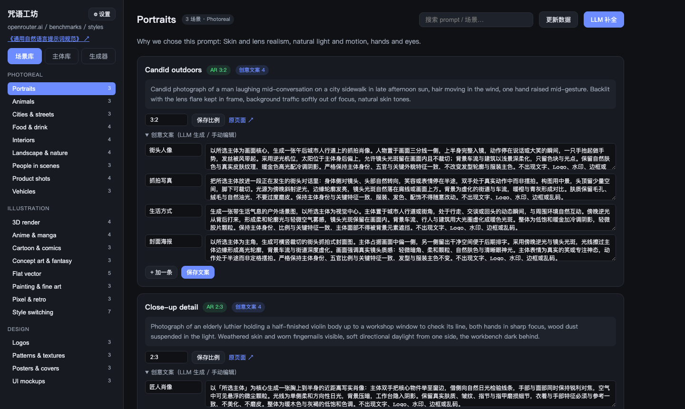
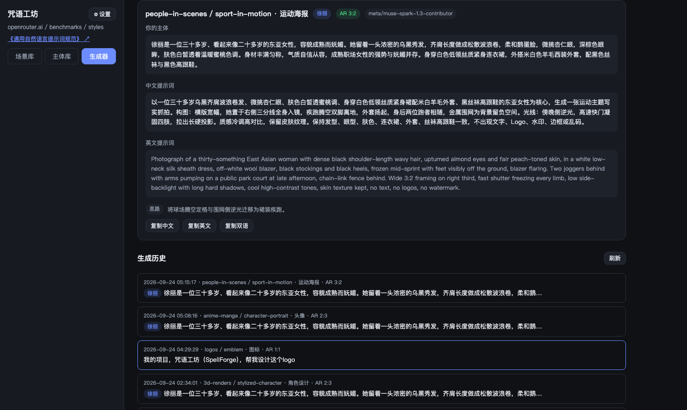
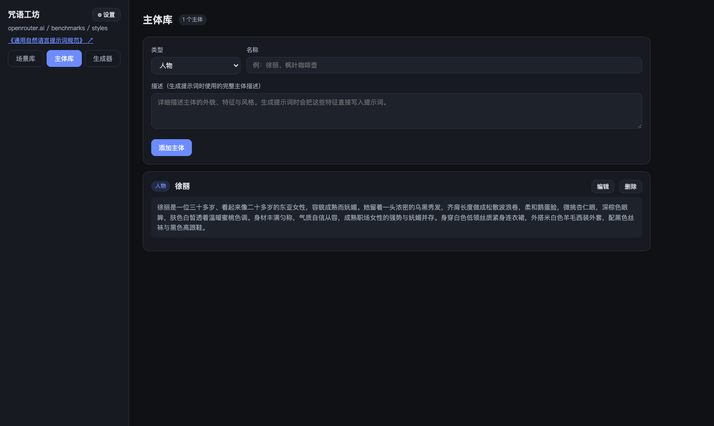
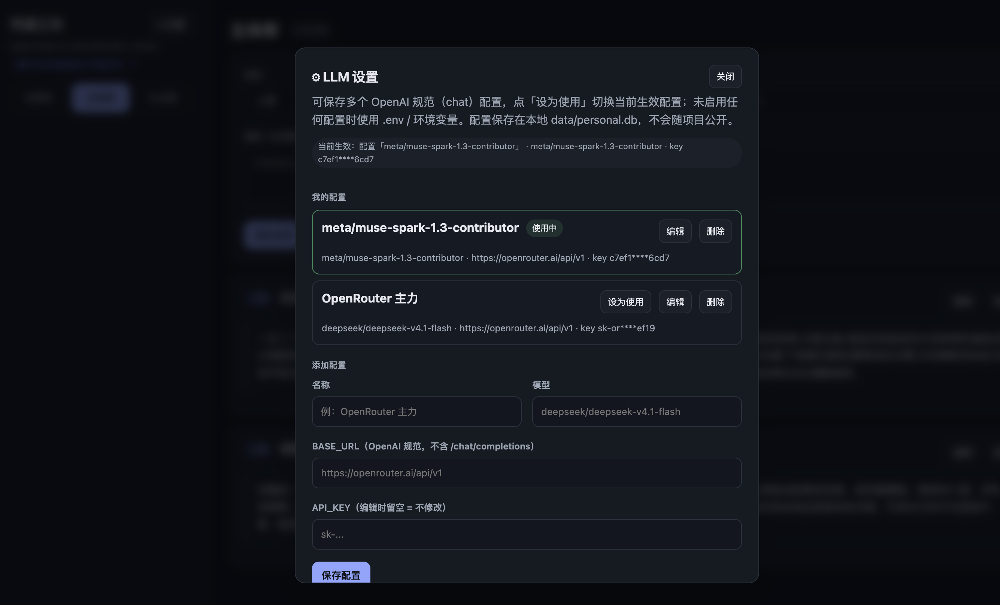

# 咒语工坊 · SpellForge

 

一条「**语料 → 规范 → 模板 → 生成**」的图像提示词生产线。

从 [openrouter.ai 图像基准](https://openrouter.ai/benchmarks/media/images) 抓取 21 个风格、75 个场景的**官方评测提示词**作为语料；用 LLM 为每条场景推断画幅比例、生成创意文案模板；从语料中提炼《通用自然语言提示词规范》；最终在 Web 工坊里按「**风格 + 模板 + 主体**」锻造新的中英双语提示词。

| 场景库 | 生成器 |
|---|---|
|  |  |

| 主体库 | LLM 设置 |
|---|---|
|  |  |

## 功能

- **场景库**：浏览 21 个风格 / 75 个场景的官方提示词与创意模板，搜索过滤、编辑画幅比例与文案、一键重新抓取最新数据
- **主体库**：管理可复用主体（人物 / 产品 / 景物 / 品牌），生成时直接选用，也可随时「自定义」手动输入
- **Prompt 生成器**：LLM 严格按《规范》生成提示词——主体外形具象化写入、动作道具适配主体身份、身份一致与负面约束收尾；输出中英双语 + 画幅建议，历史可回看
- **《通用自然语言提示词规范》**：五条总则、提示词骨架、九大维度写法、六族风格适配、画幅指引、中文模板句式与 10 条质量检查清单（[在线阅读](docs/通用自然语言提示词规范.md)）
- **LLM 设置**：多套 OpenAI 规范（chat）配置，一键切换使用；兼容任意 OpenAI 规范 provider（OpenRouter / DeepSeek 官方 / 各类中转等）

## 快速开始

```bash
git clone https://github.com/zwy/spellforge.git
cd spellforge
pip install -r requirements.txt

# 配置 LLM（也可启动后在页面左上角 ⚙ 设置里配置）
cp .env.example .env        # 填入你的 API Key

python -m web.app           # 打开 http://127.0.0.1:8765
```

> 首次运行会自动从 `data/*.json` 种子数据建库，无需任何额外步骤。
> 生成提示词需要配置任意 OpenAI 规范 API（默认演示用 OpenRouter）。

### 桌面模式（实验性）

```bash
pip install -r requirements.txt   # 含 pywebview
python -m desktop.main            # 双击等价入口：独立窗口 + 本机服务
```

- 数据保存在系统用户数据目录（macOS `~/Library/Application Support/SpellForge`，
  Windows `%APPDATA%\SpellForge`），升级或移动应用不丢失。
- 想把开发仓库 `data/` 里的旧数据带过去：先 `python -m styles.migrate` 预演，
  确认后 `python -m styles.migrate --apply`。
- WebView 运行环境：macOS 用系统 WKWebView；Windows 用 WebView2（Win10/11 一般自带，
  缺失时安装 [WebView2 Runtime](https://developer.microsoft.com/microsoft-edge/webview2/)）。
- 窗口关闭后本机服务自动退出；后端只监听 `127.0.0.1` 随机端口，
  写请求需要本次启动令牌，外部网页无法触发本机接口。

#### 应用图标

把一张正方形 logo 放到 `desktop/assets/icon.png`（建议 1024×1024、透明背景），
构建脚本会自动生成 macOS 的 `.icns` 和 Windows 的 `.ico` 并打进包里；
没有这个文件时使用系统默认图标。

#### macOS 打包

```bash
bash scripts/build_mac.sh    # 产出 dist/SpellForge.app（onedir + windowed）
```

本机试运行：

```bash
# 终端启动可看到日志；正常使用直接双击 dist/SpellForge.app
dist/SpellForge.app/Contents/MacOS/SpellForge --smoke   # 自动开窗 2.5s 自检退出
open dist/SpellForge.app
```

验收清单（已在本机验证）：把 `.app` 移动到任意位置（如 `/Applications` 或
`/tmp`）后启动，用户数据仍在 `~/Library/Application Support/SpellForge`，
修改过的数据在重启后保留；包内不含 `.env`、任何 SQLite 数据库与真实密钥。
未做事项：签名与公证、自动更新。

#### Windows 打包（钩子已留，未验证）

当前没有 Windows 环境，构建与验收留待后续：

```bat
pip install -r requirements.txt
scripts\build_windows.bat        :: 产出 dist\SpellForge\SpellForge.exe
dist\SpellForge\SpellForge.exe --smoke
```

`--smoke` 结果写入 `%APPDATA%\SpellForge\smoke_result.txt`
（windowed exe 无控制台输出）。验收清单：

- 双击 `SpellForge.exe` 出现主界面；缺 WebView2 时先装
  [WebView2 Runtime](https://developer.microsoft.com/microsoft-edge/webview2/)
- `--smoke` 后 `smoke_result.txt` 含 `port_released=yes`；任务管理器无残留进程
- 数据落在 `%APPDATA%\SpellForge`；修改数据后重启保留；移动 `dist\SpellForge`
  目录后启动数据仍在
- 包内无 `.env`、无 `.db`、无真实密钥（与 macOS 包同规格，构建后复查一次）
- 与 macOS 同等的主功能（场景库 / 主体库 / 生成 / 设置 / 历史）

### 命令行

```bash
python -m styles.scrape     # 重新抓取最新官方数据
python -m styles.enrich     # LLM 补全比例与创意模板（自动跳过已补全）
python -m styles.spec       # 重新生成《通用自然语言提示词规范》
```

## 数据说明

| 文件 | 是否入库 | 内容 |
|---|---|---|
| `data/styles.json` | ✅ 公开 | 21 风格 / 75 场景官方提示词 + 画幅 + 创意模板 |
| `data/creative_templates.json` | ✅ 公开 | 创意模板数据集（300 条，用户选择用） |
| `data/spec_vocab.json` | ✅ 公开 | 规范词汇库（LLM 提取缓存） |
| `data/subjects.json` | ✅ 公开 | 内置示例主体 |
| `data/app.db` | ❌ 派生 | 本地工作库，首次运行从种子 JSON 自动建库 |
| `data/personal.db` | ❌ 私密 | LLM 配置（含 API Key）与生成历史 |

## 项目结构

```
styles/       Python 包：schema / 抓取 / 解析 / 存储 / LLM 补全 / 规范生成 / 生成器
web/          FastAPI + 单页管理端（场景库 / 主体库 / 生成器 / 设置）
data/         JSON 种子数据（公开）+ 本地 db（gitignore）
docs/         规范文档与截图
```

## 更新日志

见 [CHANGELOG.md](CHANGELOG.md)。

## 致谢与说明

- 语料来自 [OpenRouter](https://openrouter.ai) 公开的图像基准页面，版权归 OpenRouter 所有，本项目仅作学习研究用途
- 生成提示词的质量取决于你配置的 LLM；默认模型 `deepseek/deepseek-v4.1-flash`
- 规范是纯语言层面的，不绑定任何特定图像模型
